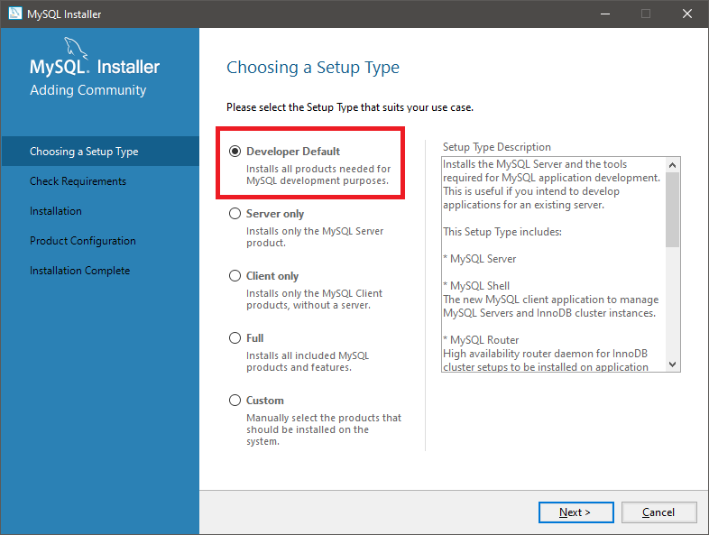
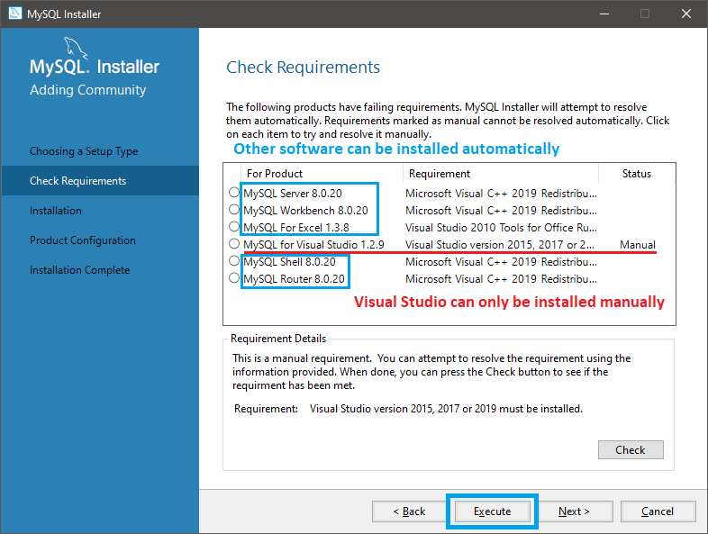
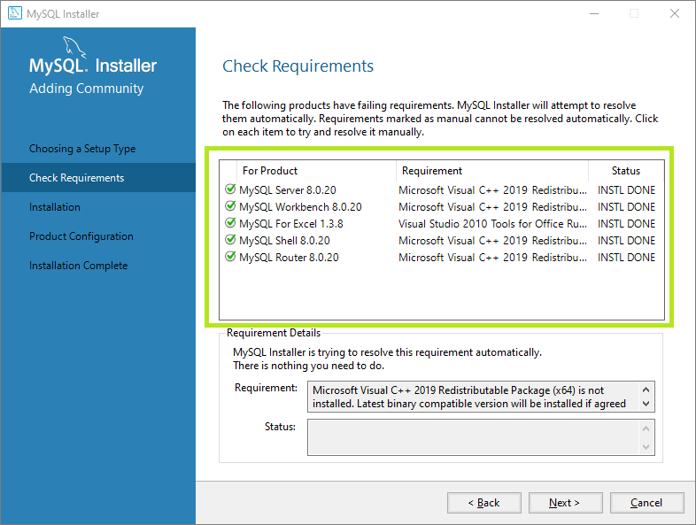
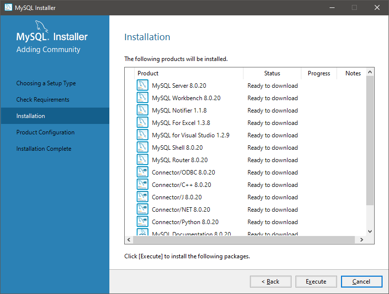
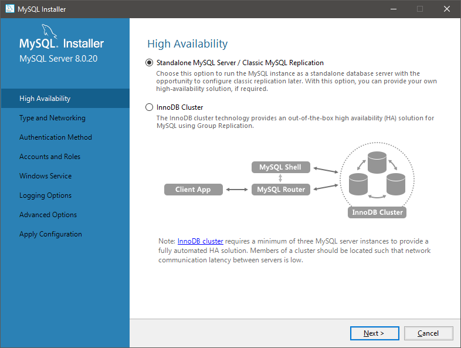
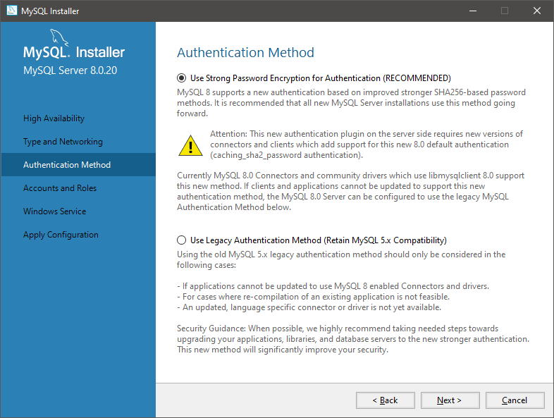
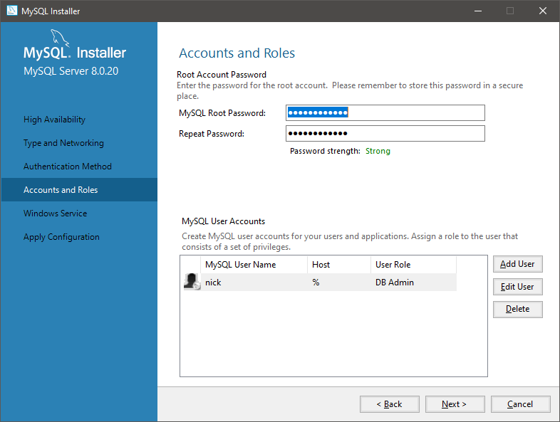
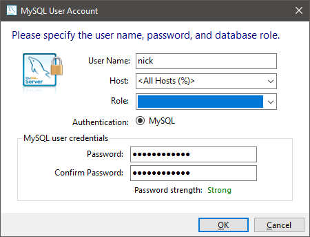
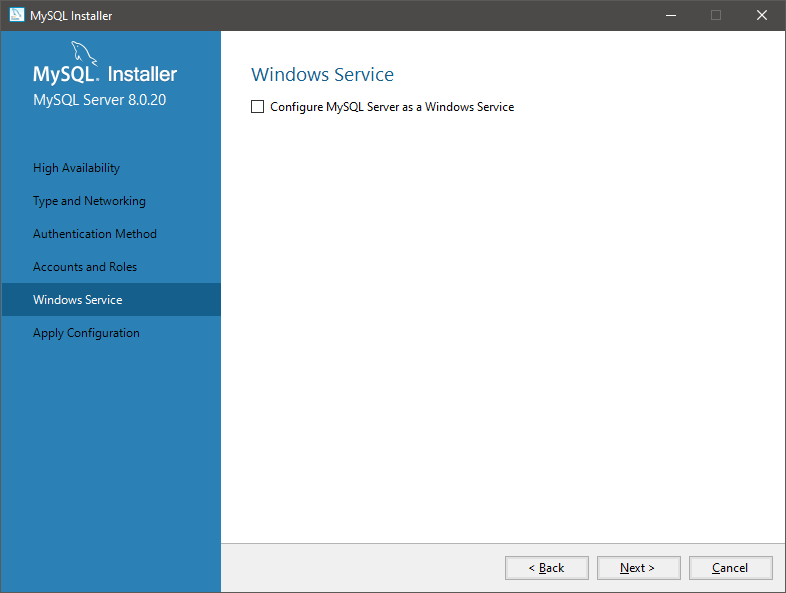
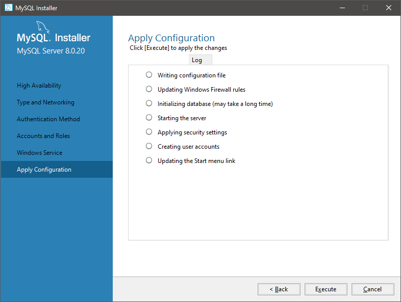

# Terminator Tutorial Part 1

Terminator is an open source terminology management platform built with Django and Python. 

## Download and Install Prerequisites

Download [Visual Studio](https://visualstudio.microsoft.com/downloads/).

The latest Community version is fine.

Make sure you install the ASP.NET workload for web development.


Download and install [Python](https://www.python.org/downloads/). Make sure you check the box "Add Python 3.x to PATH."

Download and install the latest stable version of [XAMPP](https://www.apachefriends.org/download.html).

Download and install [MySQL](https://dev.mysql.com/downloads/installer/). Install the software using the **Developer Default** Setup Type.



On the **Check Requirements** page, the installer will try to install any missing requirements automatically. If a requirement cannot be installed automatically, the **Status** may be marked as **Manual**, indicating that you need to install this software manually. Visual Studio must be installed manually.



Click **Execute** to isntruct the installer to automatically install any missing software. After the installer has finished installing the necessary utilities, you will see a screen like this.



On the **Installation** page, click **Execute** to install MYSQL.



Use the default settings when configuring Type and Networking.


On the **High Availability** screen, select **Standalone MySQL Server / Classic MySQL Replication**.



On the **Authentication Method** page, select **Use Strong Password Encryption for Authentication (RECOMMENDED)**



On the **Accounts and Roles** page, add a MySQL root password.



Click **Add User** to add a new user. The **User Role** should be **DB Admin**.



On **Windows Service**, uncheck **Configure MySQL Server as a Windows Service**. We will be using XAMPP instead.



On **Apply Configuration** click **Execute**.



Ignore the options for **MySQL Router Configuration** and just click **Finish**.

On **Connect to Server** enter your password and click **Check**. Then click **Next**.

Finally, on **Apply Configuration**, click **Execute** then **Finish**.

## Configure Python environment

Install virtualenv and virtualenvwrapper.

If on mac, open the Terminal and type the following:

```python
pip install virtualenv
pip install virtualenvwrapper
```

If on Windows, open the command line and type the following:

```
pip install virtualenv
pip install virtualenvwrapper-win
```

In the command line, enter the following commands:

```
mkvirtualenv myTB
git clone https://github.com/nicklambson/terminator.git
cd terminator
pip install -r requirements/base.txt
```

Remember! All commands should be executed inside the virtual environment! If you close the command line, remember to re-enter the virtual environment by entering this code:

```
workon myTB
```

## Start Apache and MySQL

Open XAMPP.

Start Apache, then start MySQL.

XAMPP should look like this after starting Apache and MySQL.


## Create a Database

Open MySQL Command Line Client. The password is null, so just hit enter without typing in any password.

If successful, you will see a screen like this.


Enter the following to show existing databases:

```
show databases;
```

Enter the following to create a new Term Base (TB):

```
CREATE DATABASE myTB;
```

Verify that the database was created by viewing the databases again:

```
show databases;
```

## Modify Settings

Create a copy of the settings.py file in the project folder, and rename it to local_settings.py.

Open local_settings.py.

In DATABASES, match the following settings:

```python
DATABASES = {
    'default': {
        'ENGINE': 'django.db.backends.mysql',
        'NAME': 'myTB',
        'USER': 'root',
        'PASSWORD': '',
        'HOST' : '',
        'PORT' : '3306',
        'OPTIONS': {'init_command': 'SET storage_engine=INNODB',}
    }
}
```

Important: comment out lines 201 to the end of the local_settings.py file.


## Migrate Data Structure

Navigate to the project folder inside terminator:

```
cd project
```

Populate your myTB database with structure and data from Terminator:

```
python manage.py migrate --noinput
```

If successful, you should see a screen like this:


## Create a Superuser

For the purposes of this exercise, we will create a Django superuser from the command line:

```
python manage.py createsuperuser --username=joe --email=joe@example.com
```

You will be prompted for a password. After you enter a password, the superuser will be created immediately.

## Run the Server

To run the server, enter this line in the command line:

```
python manage.py runserver
```

Access the server in your web browser at [http://localhost:8000/](http://localhost:8000/).

Terminator is now running.

Log in with the credentials of the superuser you just created:


Add /admin/ to the url to go to the Terminator administration page.

```
http://localhost:8000/admin/
```

Configure your term base according to your preference.
