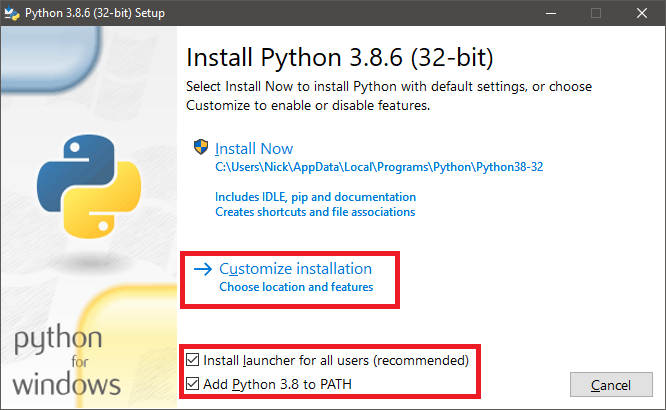
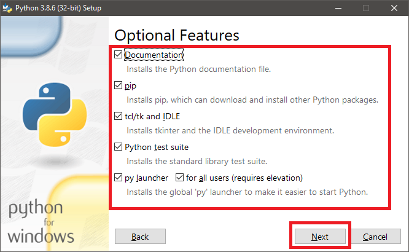
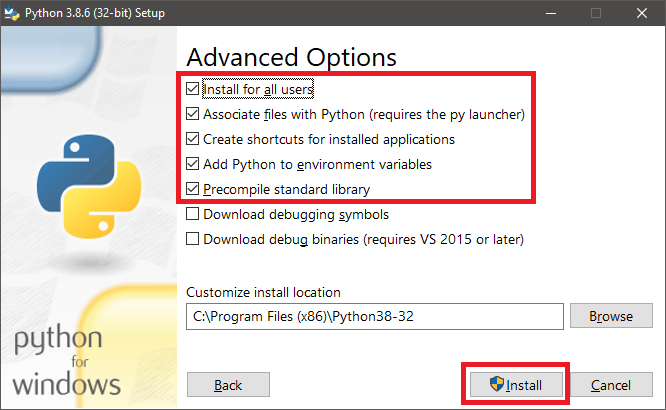
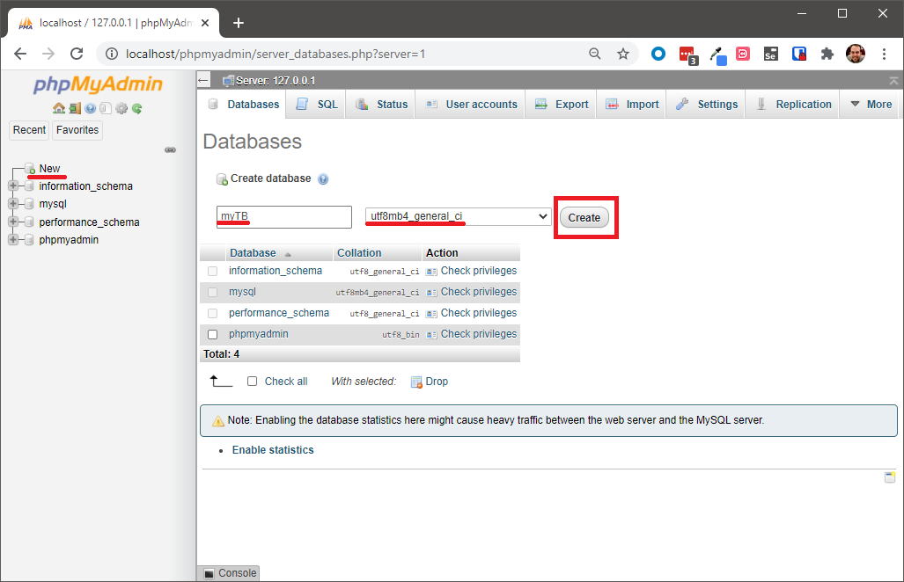

# Terminator Tutorial Part 1

Terminator is an open source terminology management platform built with Django and Python. 

## Download and Install Prerequisites

Download and install the latest stable version of [XAMPP](https://www.apachefriends.org/download.html).

Download the latest version of [Python 3.8 (32-bit) for Windows](https://www.python.org/ftp/python/3.8.6/python-3.8.6.exe). Note that Python 3.9 is not compatible.

- Double click on the installer to open it.
- Check the box "Install launcher for all users (recommended)
- Check the box "Add Python 3.x to PATH."

Click **Customize installation**.



On the **Optional Features** screen, check all the boxes and click **Next**.



On the **Advanced Options** screen, check the below boxes:

 - Check Install for all users
 - Check Associate files with Python
 - Check Create shortcuts for installed applications
 - Check Add Python to environment variables
 - Check Precompile standard library

Click **Install**.



## Configure Python environment

If you are hosting this server for the public, you must use a virtual environment! This tutorial will not use a virtual environment for the sake of simplicity and ease of use.

In the command line, enter the following commands:

```
cd %HOMEPATH%
git clone https://github.com/nicklambson/terminator.git
cd terminator
pip install -r requirements/base.txt
```

Leave the command line window open.

## Start Apache and MySQL

Open XAMPP.

Start Apache, then start MySQL.

XAMPP should look like this after starting Apache and MySQL.


## Create a Database

Click on `Admin` for MySQL in the XAMPP Control Panel. This will open phpMyAdmin.

Click `New`. Enter the name of your new database: myTB. Set the encoding to utf8mb4_general_ci. Click `Create`.



## Migrate Data Structure

Navigate to the project folder inside terminator:

```
cd project
```

Populate your myTB database with structure and data from Terminator:

```
python manage.py migrate --noinput
```

If successful, you should see a screen like this:


## Create a Superuser

For the purposes of this exercise, we will create a Django superuser from the command line:

```
python manage.py createsuperuser --username=jane --email=jane@example.com
```

You will be prompted for a password. After you enter a password, the superuser will be created immediately.

## Run the Server

To run the server, enter this line in the command line:

```
python manage.py runserver
```

Access the server in your web browser at [http://localhost:8000/](http://localhost:8000/).

Terminator is now running.

Log in with the credentials of the superuser you just created:


Add /admin/ to the url to go to the Terminator administration page.

```
http://localhost:8000/admin/
```

Configure your term base according to your preference.
